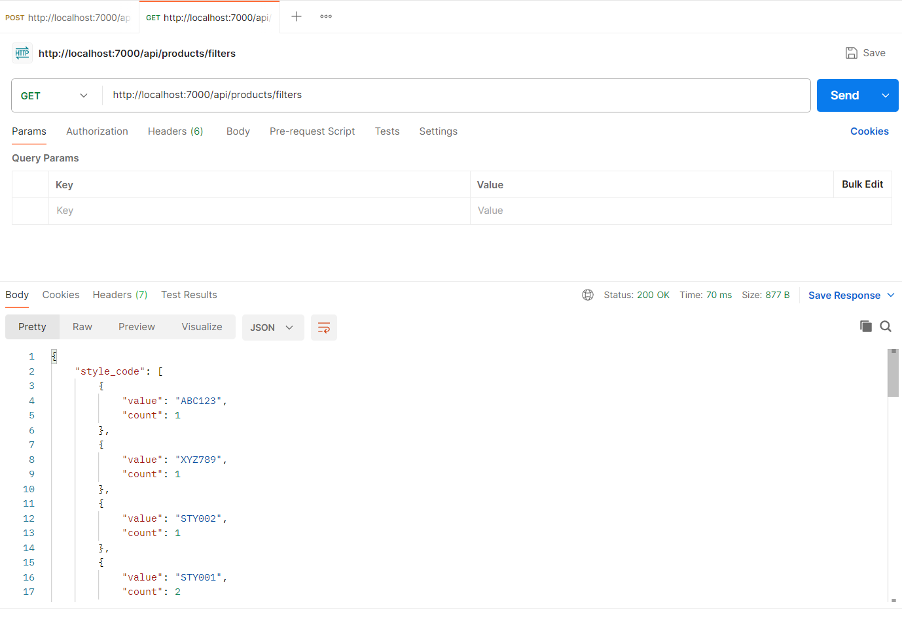

# Cloth_Catalog_Management_app

This is the backend for a simple shopping site application built with Express.js and MongoDB. It provides APIs to upload product data via CSV, fetch filter options, and retrieve filtered product data grouped by `option_code`.

## Technologies Used

- **Node.js**: JavaScript runtime for running the server.
- **Express.js**: Web framework for building RESTful APIs.
- **MongoDB**: NoSQL database for storing product data.
- **Mongoose**: ODM (Object Data Modeling) library for MongoDB.
- **Multer**: Middleware for handling file uploads (CSV files).
- **csv-parser**: Library to parse CSV files.
- **uuid**: Library to generate unique `EAN_code` values.

## Installation Steps

1. **Clone the Repository**:

   ```bash
   git clone git@github.com:Runnu-Kumari28/cloth-catalog_management_app.git
   cd backend-directory

   ```

2. Install Dependencies:
   Ensure you have Node.js installed,
   then run: npm install

3. Set Up MongoDB:
   - Install MongoDB locally or use a cloud service like MongoDB Atlas.
   - Ensure MongoDB is running on mongodb://localhost:27017. If using a different URI, update the connection string in index.js.

## Running the Backend

1. Start the Server:
   bash: node index.js

   - The server will run on http://localhost:5000
   - You should see the message: Server running on port 5000.

2. API Endpoints:
   1. POST /api/products/upload: Upload a CSV file to populate the database.
   2. GET /api/products/filters: Fetch unique filter values and option_code counts.
   3. GET /api/products: Retrieve products grouped by option_code with optional filters.

# Prerequisites

    1. Node.js (v14 or higher recommended)
    2. MongoDB (v4 or higher)
    3. npm (comes with Node.js)

# Notes

    1. Ensure the uploads/ directory exists or is writable for Multer to store temporary files.

    2. The backend assumes a local MongoDB instance. Adjust the connection string for remote databases.

# API Examples

Below are sample outputs from testing the API endpoints using Postman:

1. POST /api/products/upload

   - Description: Uploads a CSV file containing product data.
   - Request: Multipart/form-data with a CSV file.
   - Response: Success message with uploaded product count.
   - Screenshot:

2. GET /api/products/filters

   - Description: Retrieves unique filter options and counts of option_code.
   - Request: Simple GET request.
   - Response: JSON with filter values and counts.
   - Screenshot:

3. GET /api/products

   - Description: Fetches products grouped by option_code with optional query params.
   - Request: GET with optional filters (e.g., ?category=shirts).
   - Response: JSON with grouped product data.
   - Screenshot:

     1. valid params, match found:

     2. invalid params, no product match:
